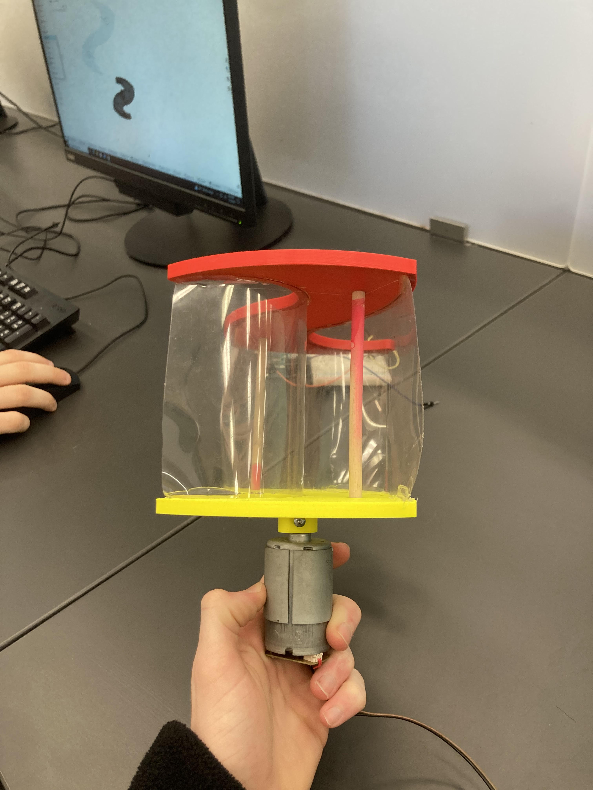
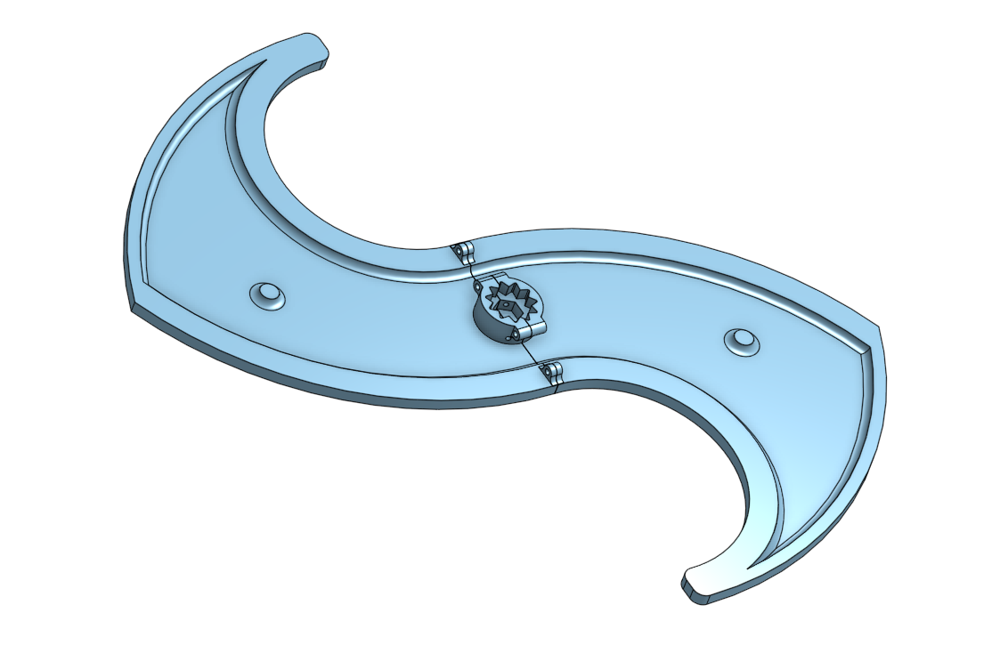

# CapstoneProject_EliasJayQuinn

 

## Table of Contents
* [Planning](#Planning)
* [Schedule](#Schedule)
* [Week Summary](#Week_Summary)

## Planning  

### Materials 

#### Bought

 - Synchronous Motor - 38$
 - Voltage regulator x3 - 3$ 
 - One-way voltage diode x3 - 5$
 - Rechargeable 5V Battery - 10-20$

#### From the Lab

 - 3D printed parts 
 - Pico+circuitry
 - PVC piping
 - Wood

### Requirements 

#### Essential

- Generate energy starting at wind speeds of 5 mph
- Average 10 Watts of energy production per hour
- Constant stream of power to an outlet  
- Firm base that does not require groundwork 
- Fits within 100 cubic feet
- Built with cheap, sustainable materials

#### Non-Essential

- Easily collapsible/can be transported easily
- Able to mount on rooftops to better use wind and not take up space
- Aesthetically pleasing design - Won’t look incredibly out of place in the park

## Schedule

### Weeks 1 - 4

Planning and Research - We will brainstorm possible designs, find our customer, and establish goals. Research needed materials and decide on our method to create each design part. Research wind speeds and park locations.

### Weeks 4 - 8 

Prototyping - We will create a quick, scaled-down version of the project to serve as a proof of concept. Possibly make multiple prototypes.

Initial Development - Begin CAD design of the parts we will 3-D print or laser cut. Create pseudo code and order the needed parts.

### Weeks 10 - 16 

Assembly - Assemble the wind turbine at CHS and do initial testing to ensure everything works.

### Weeks 16 - 20

Testing - Test at CHS and make any changes to the code or design we need. Collect data on energy production. Optimization.

### Weeks 20 - 22

Iterate - Place wind turbine in Greenleaf Park and collect data. Create a presentation for the UVA link lab.

## Week_Summary 

### Week 1 - Oct 29 - Nov 4 - 

This week we researched and ordered our charge controller. This device will assist with the circuitry by allowing us to monitor and control the voltage being produced by the system. 

[Charge Controller](https://www.amazon.com/Renogy-Wanderer-Amp-12V-24V/dp/B07NPDWZJ7?th=1)

We also communicated with our mentor, Zack Landsman, and got one of his mass-produced small-scale wind turbine. We assembled this wind turbine and once the charge controller arrives will begin to produce energy and finalize our circuitry which we will implement after creating our large-scale turbine. 

We realized that connecting the turbine blades to the motor would be more challenging than we thought. We have a couple of options from Zack, and Jay is also working on one in OnShape. Once we settle on a blade design, we can make a decision that will best match our design.

Next week when the charge controller comes we will use the miniature turbine to work on the circuitry. Until it comes, we will work on designing the wind turbine blades and attachment.  

### Week 4 - November 27 - December 1st - 

This week we 3D-designed an alternative wind turbine blade design to the one given to us by Zack. We used a Savonius design which will hopefully be more effective than the current Darreius design. Next week we are planning on printing the alternative design and then testing the power output at identical wind speeds. We also tested the power output of our current DC motor at different rpm using the INA260 Arduino module and a multimeter.
The results are as follows - 
|RPM  |Voltage|Current|Resistance|Power Output|
|-----|-------|-------|----------|------------|
|68.97|.33    |.015   |220       |.000495     |
|150  |.64    |.0029  |220       |.00186      |
|261  |1.24   |.00563 |220       |.00699      |

Here is the CAD for the alternative design - 

 

### Week 5 - December 4th - December 8th

This week we finalized our design for the prototype blade system and submitted it to be 3d printed. This included designing a motor mount, which for this first version we used the same mount as was on the blades Zach gave us. One problem we ran it to was the 3d printers only having an 8in x 8in bed. Since our design was larger than that area, we would have to either downsize it or print it in multiple pieces and bolt them together. We chose to just downsize it to reduce print time, and because this was just a simple first prototype and our goal is to test the blade design rather than completely maximize the power generated. After talking with Zach today he said he is going to bring in a fan for us on Monday that we can use to test the blades.

We used the INA260 Arduino module to test voltage, current, and power outputs from our current motor. Using a drill we were able to test the max production values for the current dc motor. Next week we will use the module and a fan to test Zach's design as well as our own at constant wind speeds. This testing will help us make decisions going forward on blade design. Next week in addition to testing we will start researching and planning our base design.   

Final Re-sized CAD design: 

Max Values for Motor from Zach - 

|Voltage   |Current  |Power Output|
|----------|---------|------------|
|1252.50 mV|481.25 mA|630.00 mW   |
|1107.50 mV|473.75 mA|520.00 mW   |
|1513.75 mV|396.25 mA|560.00 mW   |

INA260 Arduino Chip Wiring - 

### Week 6 - December 11th - December 15th

This week we 3-D printed our top and bottom part but when mirroring the bottom piece off of the top we failed to reverse it, leading to the parts not fitting. This is a valuable lesson going forward: parts should always be put into an assembly before being printed. Once the parts were correctly printed, we constructed our prototype. We used dowel rods and the flimsy plastic sheets in the back of the classroom, each cut to 4 inches in height, to combine the top and bottom and create the wings. We then used a hot glue gun to secure it all in place. It is incredibly sturdy and I think the method with two dowel rods as additional support will be helpful in our next, more finalized design. 

 

 

In the upcoming weeks, we will test our design vs Zach's to determine which design is more efficient.

### Week 7/8 - January 22 - January 25 

These past two weeks we received the charge controller which allowed us to start producing and exporting energy through multiple ports and measuring the voltage/current more efficiently. While testing our current motor we were only able to produce a maximum of 10.9 volts, not enough to efficiently charge a portable device or even a light. Before January 31st we will research and order a new motor that will produce more volts and fit into our final project design. 

### Week 7 - 10 - February 1st - 29th

We spent this month testing different motors, both with the drill and with our two current wind turbine designs. The following images and charts show our results and methods. We had a lot of difficulty in setting up the charge controller before eventually realizing there was a specific order we had to insert all the components for the design to work. It was also somewhat challenging to attach the motors to the wind turbines, so going forward we are planning on adopting Zach's new design. 

The following images and charts show our methods and findings for the past month. 

 

 

|Motor     |Max Voltage  |
|----------|-------------|
|E3E01     |6 V          |
|9015      |.8 V         |
|QK1       |6.34 V       |

|Turbine      |Max Voltage - E3E01|
|-------------|-------------------|
|Our Design   |2.2 V              |
|Zack's Design|.56 V              |

|Turbine      |Max Voltage - QK1|
|-------------|-----------------|
|Our Design   |2.3 V            |
|Zack's Design|.67 V            |

As you can see by the data, our wind turbine was much more efficient than Zack's original design, so we will be using it going forward. After getting those results, it was necessary to redesign our turbine in OnShape so that it can be printed in 4 parts with each blade being split into two parts. This will make it so we can over-double our current prototype size on the next iteration, and increase our RPM and torque for the new motor.

### Week 11- 14 - March 1st - 29th

We spent this month researching, buying, and testing a larger, more powerful motor for our project. We decided to go with a 24V, 250W, 2750 RPM [motor](https://www.amazon.com/TRKIMAL-Brushed-Permanent-Electric-2750RPM/dp/B0BKGMC9NN/ref=sr_1_5?crid=2U63XWV1PE8N8&dib=eyJ2IjoiMSJ9.5jGt5lMvCiT9zFj7sX_7uWYOqRNxDCmcIWCxGFk_ifpWKBAztrx-RHksMFOp9oVEuy6ooWajbWflYPPsai6u_H4927KeqziYJ_nlIwcE-PeqrTZp-ORyj_-4na6zN9CLkzaP62H89EqdW7P-90o99IpyonrA-RB3utSKgD5Z_kGALCcC6PnffRxQLB1TPcsuGv3ZiUghgKzVJ-7g-LQQgIprwU7_hZ2t4A4ga7UIdVwPrlUCKh-fqhfxhmJmh188EP1Thtx937tfp6-a2tVThXZXFvsexnu_PWoijo3NOio.GnfMqEu2puvhvwe57CGoIMvc8cTZRK1-A_KmW8Wv-Uw&dib_tag=se&keywords=permanent%2Bmagnet%2Bmotor&qid=1709042733&s=toys-and-games&sprefix=permanent%2Bmagnet%2Bmotor%2Ctoys-and-games%2C84&sr=1-5&th=1) as it provides a high output voltage at a lower rpm. We were unable to find this motor's max output due to its shape, but by using a drill and some tape were able to get it outputting just over 8 volts. Based on previous motors, this should translate to 4 - 6 volts in wind. 

We also redesigned our turbine heads and designed one for the new motor. We used Zach's design for our redesign, as it worked far better than what we currently had. In his design, there was a smaller piece which is printed to fit the motor head, and then that piece had a universal hexagon side attached to the motor. This allows for a tighter fit and in turn, less energy lost due to oscillation. We have two attachment pieces for our two smaller motors. For the new motor, we scaled up the design so that it has a diameter of 14.5 inches, double that of the smaller motor. The 3-D printer can only print designs up to 7 inches in diameter, so we split this design into 4 parts and will use screws via an attachment point to weld those pieces together. We then created an attachment point that will fit seamlessly with the motor head.  

